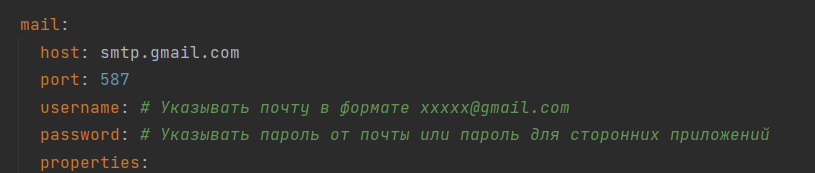

# TS-Property-Management: Тестовое задание

# Установка

### Использованный стек - Java 17, Spring Boot, PostgreSQL, Apache Kafka, Spring SMTP, Jackson

### В settings.gradle в корневой директории включены все модули.

### В проекте так же использовался docker-compose с образами PostgreSQL и Apache Kafka, Kafka-UI, Zookeeper

### Для запуска контейнеров docker-compose в фоновом режиме используйте

`docker-compose up -d`

-------

# Список сервисов:

* **Email-notification-service** - сервис, который при получении сообщения из Kafka, отправляет Email на адрес, указанный в файле
  конфигурации и сохраняет код ответа сервера в базу данных.
* **Kafka-sender-service** - сервис через Кафку отправляет данные второму сервису на отправку. Topic – `message.send`
-------

# Список endpoint'ов

## Email-notification-service

```
GET http://localhost:8082/api/messages/sent - Выводит список отправленных сообщений и код ответа от сервера email
```

## Kafka-sender-service

```
GET http://localhost:8083/messages - Выводит список сообщений по пользователю, если передан и если не передан, то последние 10 сообщений
POST http://localhost:8083/messages - При получении сообщения, сервис через Кафку отправляет данные второму сервису на отправку. Topic – message.send
```

Пример XML сообщения

```
<message>
    <sender>Aliba</sender>
    <content>Hello world</content>
</message>
```


-------
# Примечание
### В [application.yml](email-notification-service/src/main/resources/application.yml) нужно указать свою почту и пароль к ней.
### (Gmail может блокировать попытку отправки сообщения через приложения. Статья для помощи - https://support.google.com/accounts/answer/185833)


### Так же прикрепляю коллекцию постмана 2.1 в корневом каталоге
